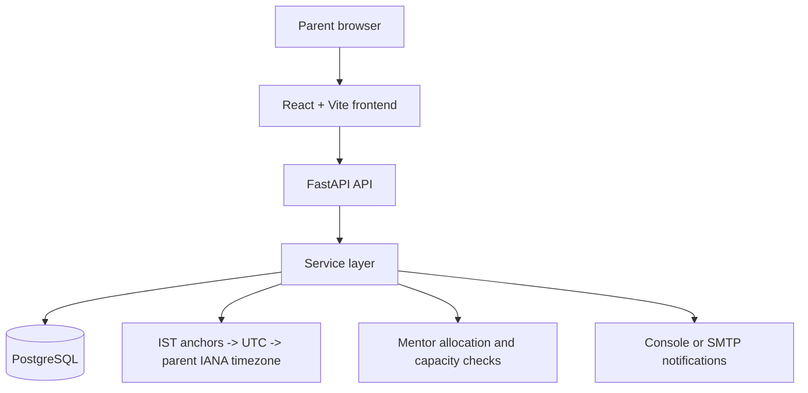

# Codeyoung Trial Class Booking System

## 1. Project Overview

This full-stack demonstration lets a parent choose a convenient trial-class time. The backend assigns an available mentor, creates a dummy classroom link, and prepares notifications for both parent and mentor.

## 2. Assignment Requirements

| Requirement | Implementation |
|---|---|
| Parent chooses convenient slot | React booking flow displays available one-hour slots in the selected IANA timezone. |
| Automatic mentor assignment | Backend selects an eligible active mentor by ascending ID. |
| 10 mentors | `backend/db/seed.py` seeds ten fictional active mentors in `Asia/Kolkata`. |
| Maximum 2 demo classes per mentor per day | Confirmed bookings are counted by IST calendar date. |
| Parent and mentor receive class link | One UUID-based dummy link is returned and included in both notification payloads. |
| Timezone-aware parent experience | Slots are converted from IST anchors to the parent timezone. |
| DST handling | Python `zoneinfo` applies IANA timezone rules. |
| Local time communication | Parent email uses the parent timezone; mentor email uses IST. |
| Dummy class link | Links use `https://class.codeyoung.com/room/<uuid>`. |
| Appropriate no-mentor-available state | Booking returns HTTP 409 Conflict. |
| React frontend | React 19 with Vite. |
| Python backend | FastAPI application with SQLAlchemy and Pydantic. |
| Git repository submission | Repository includes the application and documentation; remote submission details are To be verified. |

These are assignment requirements. Course selection, staff tools, parent normalization, and resend email are engineering/product additions, not assignment requirements.

## 3. What Was Built

- Public landing page and course selection
- Timezone-aware seven-day booking flow
- Automatic mentor allocation and dummy classroom link
- Parent/mentor console or SMTP email notifications
- Staff portal with admin dashboard and mentor view
- Course management through seeded active courses
- Mentor management, booking visibility, parent history, and email resend

## 4. Technology Stack

React 19, Vite, JavaScript, Python 3.13, FastAPI, PostgreSQL, SQLAlchemy, Pydantic, pytest, `tzdata`, and Git are present in the repository. Frontend linting uses Oxlint.

## 5. Architecture

## 6. Booking Flow

Course -> Date/Timezone -> Slot -> Parent/Student Details -> Booking -> Mentor Assignment -> Confirmation -> Emails

## 7. Timezone & DST Handling

Slots are generated at 15:00 through 21:00 IST in one-hour increments, converted to UTC, and displayed in the parent's IANA timezone. `zoneinfo` applies DST rules for zones such as `America/New_York` and `Europe/London`; tests cover EST/EDT and GMT/BST examples. SQLAlchemy models use timezone-aware timestamps, which map to PostgreSQL `TIMESTAMPTZ` when PostgreSQL is used. The fixed IST schedule and one-hour duration are product decisions implemented by the code.

## 8. Mentor Allocation

Only active mentors are eligible. The service excludes mentors already booked at the exact UTC slot or with at least two confirmed bookings on that IST calendar date, then selects the lowest mentor ID. PostgreSQL `SERIALIZABLE` transaction handling, a unique `(mentor_id, slot_utc)` constraint, and one retry address concurrency collisions. Persistent concurrency failure returns 503; no available mentor returns 409.

## 9. Database

The normalized schema is summarized in [documentation/DATABASE.md](documentation/DATABASE.md).

## 10. API

The verified route catalogue is in [documentation/API_DOCUMENTATION.md](documentation/API_DOCUMENTATION.md).

## 11. Testing & Verification

On 2026-09-27, `python -m pytest` from `backend/` collected 53 tests and reported **53 passed** with 5 warnings. `npm run build` from `frontend/` succeeded. `npm run lint` exited successfully and reported one warning for an unused catch parameter in `src/pages/BookingPage.jsx`. No coverage percentage, deployment verification, or browser automation result is claimed.

## 12. Engineering Decisions

The implementation centralizes scheduling in UTC, uses IANA timezone identifiers, keeps HTTP routers thin, places business rules in services, normalizes parents and courses, uses database constraints for integrity, and keeps the system as a simple layered FastAPI application. Dynamic capacity is active mentors multiplied by two; there is no separate hardcoded 20-parent booking ceiling.

## 13. Additional Features

Course selection, public landing pages, staff portal, admin metrics, mentor create/edit/activate/deactivate/delete operations, parent history, dual-timezone booking visibility, mentor schedule view, and configurable email resend are implemented beyond the minimum assignment.

## 14. Deliberate Non-Features / Tradeoffs

Production authentication/RBAC, payment, real video-conferencing integration, calendar sync, and a full CRM are not implemented. Email uses configured SMTP or a console simulation. Alembic is not used; table creation and explicit migration scripts are provided instead. These choices keep a recruitment demonstration focused and operationally simple.

## 15. Screenshots / Demo

Screenshot placeholders:

- Public landing page: To be added
- Course selection: To be added
- Booking flow: To be added
- Booking confirmation: To be added
- Admin dashboard: To be added
- Mentor view: To be added

Demo video: Optional — not included yet.

## 16. AI-Assisted Development

AI was used as a development assistant for incremental planning, implementation, review, debugging, and documentation. Code and repository behavior were inspected rather than blindly accepted. The complete AI session transcript is not present in this repository; [TRANSCRIPT.md](TRANSCRIPT.md) contains the required import placeholder.

## 17. Setup

Prerequisites: Python 3.13 is verified in the current environment, Node.js/npm, and a PostgreSQL database. Copy `backend/.env.example` to `backend/.env`, set `DATABASE_URL`, and optionally configure `EMAIL_BACKEND` and SMTP variables. From `backend/`, run `pip install -r requirements.txt`, `python -m db.init_db`, `python -m db.seed`, then `uvicorn main:app --reload --port 8000`. From `frontend/`, run `npm install` and `npm run dev`; set `VITE_API_BASE_URL` only when the API is not at `http://localhost:8000`. See [documentation/DEVELOPMENT_GUIDE.md](documentation/DEVELOPMENT_GUIDE.md) for details.

## 18. Disclaimer

Independent demonstration project created for a Codeyoung recruitment assessment. Not the official Codeyoung website. All sample data is fictional.
