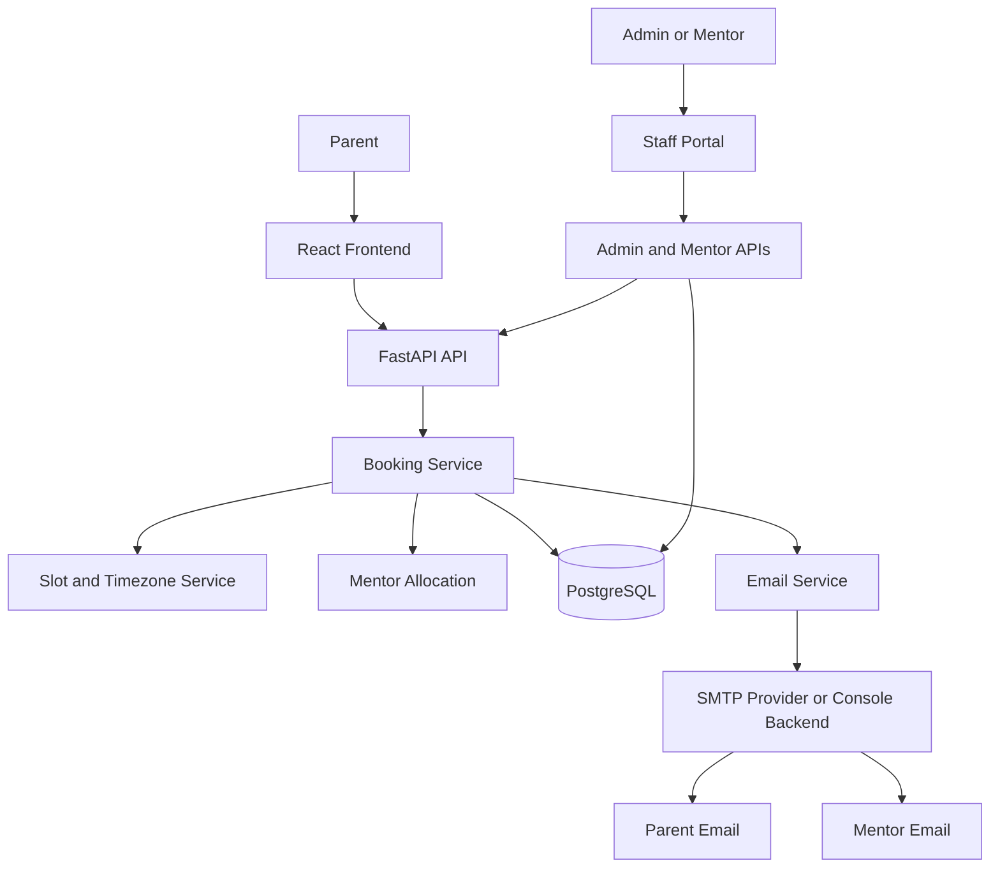
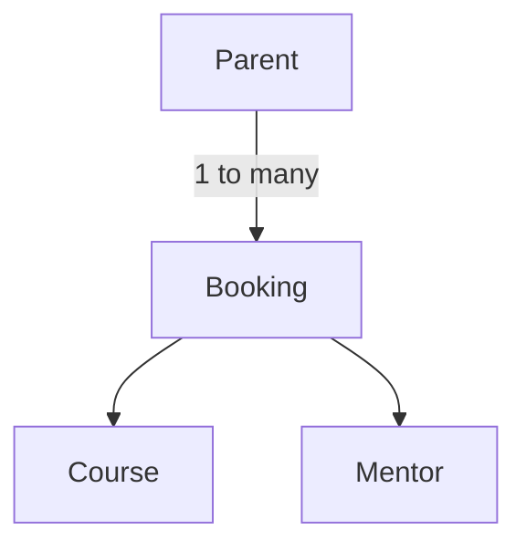

# Codeyoung Trial Class Booking System

## 1. Project Overview

This independent recruitment-assessment demonstration models a trial-class booking journey for parents and India-based mentors:

1. A parent enters the public platform and explores the course catalogue.
2. The parent selects a course, date, and timezone.
3. The system displays available trial slots in the parent's local time.
4. The parent enters parent and student details and submits a booking.
5. The FastAPI backend validates the request and automatically assigns an available mentor.
6. A unique dummy classroom link is generated and stored with the booking.
7. The frontend displays the confirmation and copyable classroom link.
8. Parent and mentor notification content is prepared in their relevant local time; delivery uses console simulation by default or configured SMTP.

The project is intentionally scoped as a focused assessment implementation, not as the official Codeyoung website or a production platform.

## 2. Assignment Requirements

| Assignment Requirement | Implementation | Evidence/Location |
|---|---|---|
| Parent chooses convenient trial slot | Parent selects a date and available one-hour slot displayed in the selected timezone. | `frontend/src/pages/BookingPage.jsx`, `backend/routers/slots.py` |
| Automatic mentor assignment | Backend filters eligible active mentors and selects the lowest mentor ID. | `backend/services/booking_service.py` |
| 10 mentors | Idempotent seed data defines ten fictional active mentors in `Asia/Kolkata`. | `backend/db/seed.py` |
| Maximum 2 demo classes per mentor per day | Confirmed bookings are counted by IST calendar date; mentors at two are excluded. | `backend/services/booking_service.py`, `backend/services/slot_service.py` |
| Parent and mentor receive class link | The same generated link is included in parent and mentor notification content and exposed in confirmation/mentor views. | `backend/services/email_service.py`, `frontend/src/components/BookingConfirmation.jsx` |
| Timezone-aware experience | IANA timezone selection/detection and server-side UTC-to-local conversion. | `backend/services/timezone_service.py`, `frontend/src/components/TimezoneDatePicker.jsx` |
| Local-time communication | Parent email uses the parent's timezone; mentor email uses IST. | `backend/services/email_service.py` |
| DST handling | Python `zoneinfo`/`tzdata` applies IANA DST rules. | `backend/services/timezone_service.py`, `backend/tests/test_timezone.py` |
| Dummy class link | A UUID-based `https://class.codeyoung.com/room/<uuid>` link is generated. | `backend/services/booking_service.py` |
| No mentor available error state | No eligible mentor raises HTTP 409 Conflict and the frontend displays an error state. | `backend/routers/bookings.py`, `frontend/src/pages/BookingPage.jsx` |
| React frontend | React 19 application bundled with Vite. | `frontend/package.json`, `frontend/src/` |
| Python backend | FastAPI application using Pydantic and SQLAlchemy. | `backend/main.py`, `backend/requirements.txt` |
| GitHub submission | The project is organized as a Git repository; remote/submission details are To be verified. | Repository root, `.gitignore` |
| README | This recruiter/evaluator-facing document. | `README.md` |
| Full AI transcript | Required file exists as a non-fabricated import placeholder; the complete exported transcript is not currently present. | `TRANSCRIPT.md` |

The items above are assignment requirements. Course selection, staff operations, parent normalization, email resend, and the public landing experience are additional engineering/product features.

The assignment's “20 parents/day” context is not implemented as a separate hard booking limit. The application calculates operational capacity dynamically as active mentors multiplied by two.

## 3. Complete Feature Set

### Public/User Features

- Responsive public landing page with hero, course section, how-it-works content, features, testimonials, FAQ, CTA, and footer.
- Backend-backed active course catalogue plus illustrative “Coming Soon” landing cards.
- Course-specific booking flow with URL course selection support.
- Date selection across the configured future booking window.
- Browser timezone detection with a curated timezone selection interface.
- Timezone-aware slot display and DST-aware conversion.
- Parent and student information form with client-side validation.
- Booking confirmation showing booking reference, scheduled time, assigned mentor label, and classroom link.
- Copyable classroom link and join/open classroom action.
- Loading, validation, connectivity, conflict, and empty-slot states.
- Responsive mobile/desktop layout and public section navigation.
- Login/demo portal entry for Admin and Mentor views; Student access is intentionally unavailable.
- Privacy Policy, Terms of Use, and recruitment-project disclaimer UI placeholders.

### Booking & Scheduling Engine

- Filters to active mentors only.
- Excludes mentors already assigned at the exact UTC slot.
- Excludes mentors with two or more confirmed bookings on the same IST calendar date.
- Selects an eligible mentor deterministically by ascending mentor ID.
- Stores the canonical appointment instant as a timezone-aware UTC timestamp.
- Generates seven IST anchors at 15:00 through 21:00, inclusive, in one-hour increments.
- Validates IANA timezone identifiers.
- Validates UTC-aware timestamps, top-of-hour alignment, allowed IST hours, and the future booking window.
- Rejects invalid, stale, out-of-window, or inactive-course booking requests.
- Returns HTTP 409 when no mentor is available.
- Uses a named unique `(mentor_id, slot_utc)` database constraint as a same-mentor/same-slot guard.
- Requests PostgreSQL `SERIALIZABLE` transaction handling and retries retryable serialization, deadlock, or unique-conflict failures once.
- Returns HTTP 503 if a retryable concurrency failure persists.

The application performs layered eligibility and database checks; the documentation does not claim stronger concurrency guarantees than those implemented by the service, transaction configuration, and database constraint.

### Email & Notifications

- Builds a parent confirmation email containing course, student, mentor, time, timezone, booking reference, and classroom link.
- Builds a mentor assignment email containing course, student, parent, IST time, booking reference, and the same classroom link.
- Renders parent notification time in the parent's IANA timezone.
- Renders mentor notification time in `Asia/Kolkata`.
- Supports `EMAIL_BACKEND=console` for local development; console delivery logs the message and records a bounded in-memory recent-email queue.
- Supports `EMAIL_BACKEND=smtp` through Python `smtplib`.
- Reads SMTP host, port, username, password, sender, and TLS settings from environment configuration.
- Commits the booking before notification dispatch; notification errors are caught/logged and do not roll back a confirmed booking.
- Supports admin and mentor resend actions with parent/mentor recipient selection and an optional custom subject.

SMTP capability is implemented. Real external SMTP delivery was not manually verified in the repository evidence available for this documentation.

### Admin & Staff Features

- Staff Portal entry page with Admin and Mentor demo navigation.
- Explicit notices that production authentication and role-based access control are not implemented.
- Admin dashboard with dynamic capacity and operational metrics.
- Mentor roster with status, timezone, daily class load, and capacity indicator.
- Mentor create, read, edit, activate/deactivate, and conditional delete operations.
- Mentor timezone validation and duplicate-email protection.
- Parent directory with confirmed booking counts.
- Parent booking-history inspection.
- Confirmed booking list with parent-local and mentor-IST times, course, assigned mentor, and classroom link.
- Email resend from admin and mentor screens.
- Mentor view with mentor selector, assigned-class schedule in IST, parent contact, course, status, classroom link, and resend action.
- Staff navigation between Staff Home, Admin Dashboard, Mentor View, and the public website.

Authentication/RBAC is **not implemented**. These screens are demonstration/internal assessment views, not secured production portals.

### Course Management

- Courses are stored in PostgreSQL and returned by `GET /api/v1/courses` when active.
- Course selection occurs before slot and parent-detail submission.
- Each booking has a required `course_id` foreign key and exposes `course_name`.
- Active/inactive course state exists in the data model.
- New bookings reject an invalid or inactive course.
- Existing bookings retain their course relationship through the foreign key.
- Default demo courses are seeded by the course migration script.
- Admin course create/edit/activation controls are **not implemented** in the current UI or API. The current admin controls provide course visibility through bookings, while course records are managed by seed/migration scripts.

## 4. Application Architecture

```mermaid
flowchart LR
        subgraph FE[FRONTEND]
                UI[React + Vite]
                PUBLIC[Landing Page<br/>Course Catalogue<br/>Booking Flow]
                STAFF[Staff Portal<br/>Admin Dashboard<br/>Mentor View]
                NAV[Navigation / Routing<br/>Responsive UI]
                UI --> PUBLIC
                UI --> STAFF
                UI --> NAV
        end

        subgraph BE[FASTAPI BACKEND - MODULAR MONOLITH]
                subgraph API[API / ROUTER LAYER]
                        ROUTES[Health | Courses | Slots<br/>Bookings | Admin | Mentor<br/>Email Resend]
                end

                subgraph SERVICES[SERVICE LAYER]
                        BOOK[Booking Service<br/>Mentor allocation<br/>Slot availability<br/>Daily capacity<br/>Booking validation]
                        TIME[Slot / Timezone Service<br/>IST anchors | UTC conversion<br/>IANA conversion | DST handling]
                        COURSE[Course Service<br/>Active-course listing<br/>Course validation]
                        PARENT[Parent Service<br/>Parent lookup and creation]
                        ADMIN[Admin Service<br/>Mentor management<br/>Parent / booking visibility]
                        EMAIL[Email Service<br/>Parent confirmation<br/>Mentor notification<br/>Email resend<br/>Console / SMTP mode]
                end

                subgraph VALID[VALIDATION / SCHEMA LAYER]
                        PYD[Pydantic Schemas]
                end

                subgraph DATA[DATA LAYER]
                        ORM[SQLAlchemy Models]
                        TX[Database Session<br/>Transactions]
                end

                ROUTES --> SERVICES
                ROUTES --> PYD
                SERVICES --> ORM
                SERVICES --> TX
                ORM --> TX
        end

        subgraph DB[POSTGRESQL]
                TABLES[Parents | Mentors | Courses | Bookings<br/>Constraints | Relationships]
        end

        subgraph OUT[EMAIL DELIVERY]
                SMTP[SMTP Provider<br/>Gmail or other SMTP]
                CONSOLE[Console Backend]
                RECIPIENTS[Parent Email<br/>Mentor Email]
                SMTP --> RECIPIENTS
                CONSOLE --> RECIPIENTS
        end

        FE -->|REST / JSON| API
        TX -->|SQLAlchemy ORM| TABLES
        EMAIL --> SMTP
        EMAIL --> CONSOLE
```

The application follows a modular monolith architecture. The React frontend communicates with a single FastAPI application through REST APIs. Within the backend, routers handle HTTP concerns while domain-oriented service modules contain business logic for booking, scheduling/timezones, courses, parents, administration, and email. Pydantic schemas handle API validation and SQLAlchemy models provide the persistence layer over PostgreSQL.

Although the backend contains multiple services, these are modules within one deployable FastAPI application, not independent microservices.

This approach was chosen because booking and mentor allocation are transaction-sensitive and share one relational data boundary. A microservices split would add network calls, distributed transaction concerns, deployment overhead, and operational complexity without a clear benefit at the scale of this assessment.

## 5. Why Not Microservices?

A modular monolith is an intentional fit for this assessment:

- The assignment scale is small and has one bounded booking domain.
- Booking and mentor allocation are transaction-sensitive.
- One PostgreSQL database provides the required relational integrity and transaction boundary.
- Microservices would introduce network boundaries between tightly related booking operations.
- Distributed transactions would make mentor allocation and booking consistency harder to reason about.
- Separate deployment, observability, and service discovery would add operational complexity without a demonstrated need.
- Internal service boundaries still preserve separation and testability.
- Individual modules could be extracted later if scale, team ownership, or workload justified it.

## 6. System Flow



## 7. Booking Flow

1. The parent selects a course.
2. The parent selects an IST calendar date.
3. The parent selects or confirms an IANA timezone.
4. The backend generates IST anchors, converts them to UTC and parent-local display values, and filters unavailable slots.
5. The parent selects an available slot.
6. The parent submits parent and student details.
7. The backend validates the course, timezone, UTC timestamp, slot shape, allowed hours, and date window.
8. Mentor eligibility is calculated using active status, exact-slot occupancy, and IST-day capacity.
9. An eligible mentor is selected deterministically.
10. The normalized parent is created or reused and the booking is committed.
11. A UUID-based dummy classroom link is generated as part of the booking record.
12. Parent and mentor notification content is dispatched through console or configured SMTP after commit.
13. The booking response returns to React and the confirmation view displays the result and link.

## 8. Timezone and DST Design

- Inputs use IANA timezone identifiers such as `America/New_York` and `Europe/London`.
- Mentor scheduling is anchored in `Asia/Kolkata` (IST), which is treated as the scheduling reference zone.
- The backend converts IST anchors to UTC and treats UTC as the canonical appointment representation.
- The frontend displays the server-provided local representation rather than recomputing the selected instant for submission.
- Parent email content is formatted in the parent's timezone; mentor email content is formatted in IST.
- Python `zoneinfo` and the pinned `tzdata` package apply DST rules without manual offset arithmetic.
- SQLAlchemy timezone-aware `DateTime` fields are intended for PostgreSQL `TIMESTAMPTZ` storage.
- Mentor daily capacity is calculated using the IST calendar date derived from `slot_utc`.

The one-hour class duration, 15:00-21:00 IST anchors, and tomorrow-through-seven-days-ahead booking window are engineering/product decisions implemented by the current code, not presented as independent assignment requirements.

## 9. Data Model



- **Parent:** normalized identity keyed by unique email; one parent may have multiple bookings.
- **Booking:** appointment record containing parent, mentor, course, canonical slot, timezone, status, classroom link, and creation timestamp.
- **Course:** selectable course with unique name, description, active state, and creation timestamp.
- **Mentor:** mentor identity, unique email, IANA timezone, and active state.
- **Foreign keys:** bookings reference parents, mentors, and courses with restrictive deletion behavior.
- **Booking integrity:** `uq_mentor_slot_utc` prevents one mentor from occupying the same UTC slot twice.

See [documentation/DATABASE.md](documentation/DATABASE.md) for the schema details.

## 10. Admin Data Control

The admin dashboard provides CRUD-style operational control over mentors:

- **Mentors:** create, read, update, activate/deactivate, and delete where permitted.
- **Mentor deletion:** deletion is rejected when historical bookings exist; the service instructs operators to deactivate instead. This protects booking history and works with restrictive foreign keys.
- **Parents:** read the directory and inspect booking history.
- **Bookings:** read confirmed bookings, inspect the assigned mentor, course, parent-local time, mentor-IST time, classroom link, and resend an email.
- **Courses:** active courses can be read for public booking and course data is linked to bookings. Course create/edit/activate/deactivate controls are not present in the current admin API/UI; seed and migration scripts provide the current demo course data.

## 11. API

See [documentation/API_DOCUMENTATION.md](documentation/API_DOCUMENTATION.md) for the verified route catalogue, request fields, responses, and errors.

The API domains are:

- **Health:** process status.
- **Courses:** active course listing.
- **Slots:** date/timezone-aware available slot listing.
- **Bookings:** create and retrieve bookings.
- **Mentor:** retrieve confirmed mentor bookings and internal schedules.
- **Admin:** operational metrics, mentor management, parent/booking visibility, and resend email.
- **Email resend:** admin booking email resend with recipient and subject overrides.

## 12. Security and Data Integrity

Implemented safeguards include:

- Pydantic request and response validation.
- IANA timezone validation through `zoneinfo`.
- SQLAlchemy ORM for runtime database access.
- Foreign keys and restrictive deletion rules for parent, mentor, course, and booking relationships.
- Unique mentor email, parent email, course name, and mentor-slot constraints.
- Environment-based database and SMTP settings.
- `.env` is listed in `.gitignore`; real credential presence is not claimed.
- UTC-aware timestamp and booking-slot validation.
- PostgreSQL transaction isolation request and retry handling for retryable booking conflicts.
- Explicit error mapping for validation, no-mentor, missing-record, and persistent-concurrency cases.

Runtime data access uses SQLAlchemy, while the explicit migration script contains SQL needed for schema transition. Production authentication, authorization, and RBAC are not implemented.

## 13. Testing

The current verified results are:

- Backend `python -m pytest`: **53 passed**; the run reported five warnings.
- Frontend `npm run build`: passed.
- Frontend `npm run lint`: exits successfully with one existing unused catch-parameter warning in `src/pages/BookingPage.jsx`.

Tests cover the implemented areas supported by the repository, including:

- booking creation and invalid-course rejection
- timezone conversion and IANA validation
- US and UK DST behavior
- booking-window/date boundaries
- parent normalization and relationships
- mentor count/assignment and inactive-mentor exclusion
- mentor-slot uniqueness
- email formatting, console dispatch, SMTP configuration validation, post-commit failure handling, and resend overrides
- admin metrics, capacity, mentor lifecycle, parent history, booking visibility, and mentor schedule

No 100% coverage claim is made. A dedicated concurrent multi-request integration test and automated browser/screenshot verification are To be verified.

See [documentation/TESTING.md](documentation/TESTING.md).

## 14. Engineering Decisions

- **FastAPI + React:** FastAPI provides typed HTTP validation and a focused Python backend; React handles the multi-step interactive booking experience.
- **PostgreSQL:** Relational constraints and transactions match the consistency needs of mentor allocation and booking.
- **Modular monolith:** Domain-oriented modules provide separation without distributed-system overhead.
- **Service layer:** Booking, timezone, course, parent, admin, slot, and email rules stay out of HTTP routers.
- **UTC-first time handling:** One canonical instant prevents cross-timezone ambiguity.
- **Database constraints:** The database remains a final integrity boundary for relationships and mentor-slot uniqueness.
- **Serializable booking transaction:** The service requests stronger isolation for contention-sensitive booking work and retries retryable failures once.
- **Normalized parents and courses:** Reusable entities reduce repeated parent identity and course data in bookings.
- **Configurable email backend:** Console mode supports local assessment use; SMTP mode provides an integration path without hardcoding credentials.
- **Simple frontend styling:** React and project CSS are used without an unnecessary UI/state-management dependency layer.
- **Explicit non-features:** Production auth, microservices, and enterprise infrastructure were kept out of scope intentionally.

## 15. Additional Features

The following go beyond the minimum assignment and are implemented unless explicitly marked otherwise:

- Public course catalogue and responsive landing experience
- Course selection before booking
- Staff Portal
- Admin dashboard and dynamic capacity metrics
- Mentor dashboard/schedule view
- Parent directory and parent booking history
- Mentor CRUD, status controls, timezone validation, and deletion safeguards
- Booking/mentor/course visibility
- Email resend with recipient selection and optional custom subject
- Privacy, Terms of Use, disclaimer UI, and additional public/internal navigation

Course administration CRUD is not included; only course retrieval, booking linkage, validation, and migration/seed management are implemented.

## 16. Deliberate Non-Features

These were intentionally kept out of scope for a focused assessment implementation:

- Production authentication and RBAC
- Real video conferencing integration
- Payment processing
- Calendar synchronization
- Full CRM or enterprise administration
- Complex asynchronous notification queue and delivery observability
- Microservices and distributed transactions
- Production deployment infrastructure and URLs
- Alembic migration framework

These are scope decisions, not claims that the current demonstration is production-ready.

## 17. Screenshots / Demo

The following section is prepared for real assets only. No screenshots or demo URLs are fabricated.

1. Landing Page: **Screenshot to be added**
2. Course Selection: **Screenshot to be added**
3. Booking Flow: **Screenshot to be added**
4. Booking Confirmation: **Screenshot to be added**
5. Admin Dashboard: **Screenshot to be added**
6. Mentor View: **Screenshot to be added**
7. Email Notification: **Screenshot to be added**
8. Mobile View: **Screenshot to be added**

Demo video: Optional — not included yet.

## 18. AI-Assisted Development

AI was used as a development assistant for planning, architecture discussion, implementation assistance, debugging, testing guidance, and documentation. Human verification included inspecting the code, executing the backend tests, executing frontend lint/build commands, and reviewing changes incrementally.

The complete AI transcript is not available as an exported source in the current repository. `TRANSCRIPT.md` intentionally contains only a placeholder and must be populated from the actual AI tool export before submission. No transcript content has been fabricated.

## 19. Setup

### Prerequisites

- Python 3.13 was used for the verified backend test run.
- Node.js/npm for the Vite frontend.
- PostgreSQL and a database accessible through `DATABASE_URL`.

### Backend Environment

From the repository root in PowerShell:

```powershell
cd backend
python -m venv .venv
.venv\Scripts\Activate.ps1
pip install -r requirements.txt
Copy-Item .env.example .env
```

Edit `backend/.env` and set `DATABASE_URL`. Optional email settings are `EMAIL_BACKEND`, `SMTP_HOST`, `SMTP_PORT`, `SMTP_USERNAME`, `SMTP_PASSWORD`, `SMTP_FROM`, and `SMTP_USE_TLS`. `EMAIL_BACKEND=console` is the default local simulation.

### Database Initialization

```powershell
cd backend
python -m db.init_db
python -m db.seed
```

The repository also contains explicit migration scripts for later schema changes. Run only the migration appropriate to the database state.

### Run the Backend

```powershell
cd backend
uvicorn main:app --reload --port 8000
```

FastAPI's generated API documentation is available at `http://localhost:8000/docs` while the server is running.

### Run the Frontend

```powershell
cd frontend
npm install
npm run dev
```

The frontend defaults to `http://localhost:8000` for API calls and Vite normally serves the frontend at `http://localhost:5173`. Set `VITE_API_BASE_URL` when the API uses another URL.

### Test, Lint, and Build

```powershell
cd backend
python -m pytest
cd ..\frontend
npm run lint
npm run build
```

## 20. Submission Checklist

- [ ] GitHub repository and remote submission details confirmed
- [x] `README.md`
- [x] `TRANSCRIPT.md` placeholder present; real transcript still required
- [x] `documentation/`
- [x] Backend tests passing in the verified run
- [x] Frontend build passing in the verified run
- [x] Lint reviewed; one existing warning documented
- [x] No secrets committed in the inspected worktree; `.env` is ignored
- [ ] Screenshots added, if included in the submission
- [ ] Optional demo video added, if included
- [ ] Final git status clean after submission preparation
- [ ] Submission email prepared

## Disclaimer

Independent demonstration project created for a Codeyoung recruitment assessment. Not the official Codeyoung website. All sample data is fictional.
