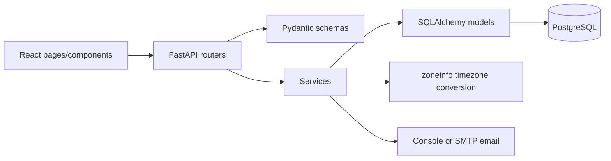

# Architecture

## Overview

The project is a layered application: React/Vite presents public and staff views, FastAPI exposes HTTP routes, services own business rules, SQLAlchemy models map PostgreSQL data, and email delivery is handled after booking commit.

## Frontend

`frontend/src/App.jsx` selects landing, booking, staff, admin, or mentor views. `pages/` contains page-level flows; `components/` contains forms, slot selection, confirmation, landing content, and staff UI; `api/` centralizes fetch calls; `utils/dateUtils.js` contains date helpers; `index.css` contains styling.

## Backend

- `main.py`: FastAPI app, CORS, health route, and router registration.
- `routers/`: HTTP parameters, validation, and status-code translation.
- `schemas/`: Pydantic request and response contracts.
- `services/`: timezone, slot, booking/allocation, parent, course, email, and admin logic.
- `models/`: Parent, Mentor, Course, and Booking ORM entities.
- `db/`: table creation, mentor seed, and parent-normalization migration.

## Flows

The frontend requests active courses and available slots. Slots are generated from IST anchors and filtered against current mentor eligibility. A booking request includes course, parent/student details, IANA timezone, and canonical UTC slot. The service validates input, derives the IST date, allocates a mentor, creates or reuses the parent, commits, and then sends notifications.

Allocation excludes inactive mentors, exact-slot conflicts, and mentors with two confirmed bookings on the IST date. Selection is deterministic by mentor ID. PostgreSQL `SERIALIZABLE` handling, a unique `(mentor_id, slot_utc)` constraint, and one retry address concurrency collisions; persistent retryable failure becomes HTTP 503.

Timezone code generates 15:00 through 21:00 IST anchors, converts to UTC, and converts UTC to the parent's IANA timezone. Parent email uses the parent timezone; mentor email uses `Asia/Kolkata`. Email is console simulation by default or SMTP when configured. The intentionally simple architecture does not include authentication, payments, video integration, calendar integration, or independent services.
